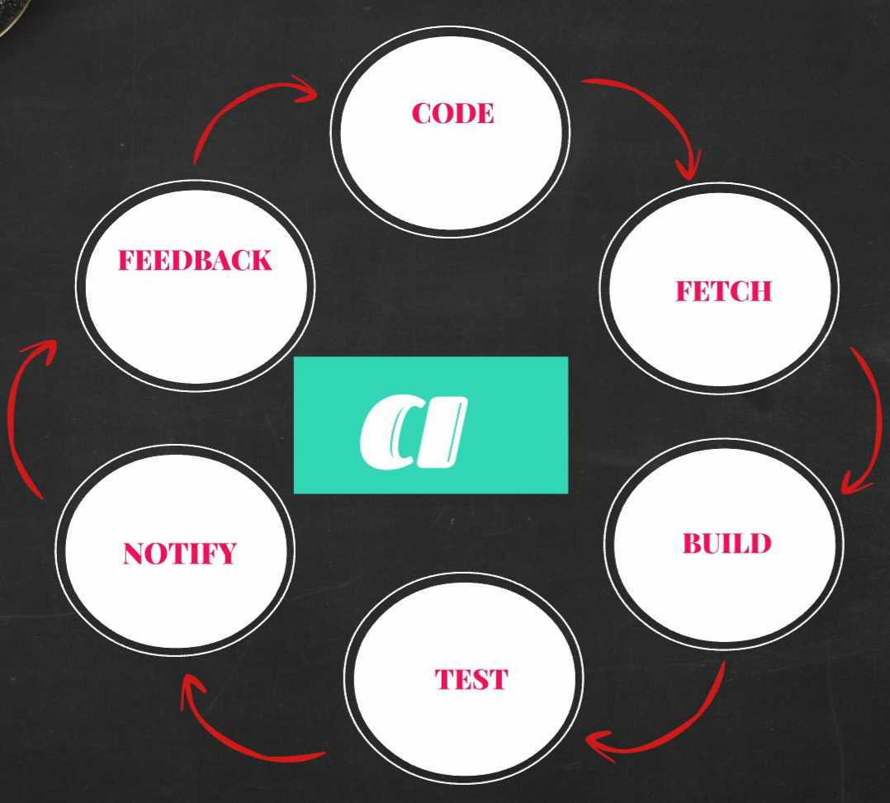

# Introduction to DevOps

DevOps simply means combination of two words Development and Operations which describes the set of practices and tools that helps organizations to deliver applications and services very quickly. It bridges the gap between Development and Operations team. The main aim of the Devops is to improve the collaboration between the Devlopment team and operations team which increases the efficiency of software development process and ultimately produces better products very quickly. To know what actually devops means and what we actually use it for, first we need to know software devlopment process.

## Software Development Life Cycle

- SDLC simply means life cycle of buliding a software product. This process invloves six phases.

  1. **Requirement Gathering** : In this phase basic information about product will be collected such as Users of the Product, Usage of the Product, Product Features, User Requirements and current state of market etc.

  2. **Planning** : In this phase, business persons determine the budget needs to be allocated for this project (cost of the project), resources required to implement the project and risks associated with this project.

  3. **Designing** : In this Phase, Architects will design the software based on the inputs from previous phases and produce design documents which are basically the roadmap for developers for writing the software code.

  4. **Development** : In this Phase, Developers actually write the code for software based on the design documents from design phase.

  5. **Testing** : In this phase, testers actually test code and return back the code to developers if they find any bugs in the code. 

  6. **Deploy and Maintainance** : In this phase, Operations team deploy the software tested by the testers and moniter the health of the servers and make them up all the time.

- There are so many models in Software Development Life Cycle. Some of those are WaterFall, Agile, Spiral, Big Bang etc. We can think these models are different pathways to build a software. We can access these pathways based on the cost, risks and time taken to reach destination.

  1. **WaterFall Model** : In WaterFall Model, We can move to next step only when the current step is completed. That means if you are in designing step currently, you can move to development step only when you have completed the entire design of the product. Once you completed that step you cannot go back. So we can say Waterfall Model is straight forward Process.

  2. **Agile Model** : Agile Methodology is iterative process. In this model, we actually divide entire SDLC process into different time frames. In each time frame, we complete the all the 6 steps of SDLC process. That means in first frame, software development team completes all the 6 steps and produces an initial product. In next frame, they starts adding more functionalites to the inital product by executing all these 6 steps again. So in agile methodology, we iteratively design the software product instead of straight forward approach.

- Nowadays many software industries use agile methodology to build the software product. But there are some disadvantages with this methodology. Those are :

  1. In Agile Methodology, there is no proper coordination between the Development and Operations Team. Because developers focuses mainly on developing the software whereas operations team focuses mainly on delopying the software product and making the servers up all the time. So there is clear gap betweeen goals of both teams. Each team doesn't know what others are doing.

  2. Generally operations team is responsible for deploymnet of the software written by developers. They actually deploy the software based on the instructions given by the development team. Since they run on different environments operations team might not install some of the requirements or dependencies which are prone to errors and leads in delays in deployment of the product which automatically delays the delivery process. 

  3. In Agile Methodology, everything is manual process. Most of the steps need man power. Since it requires lot of manual work, so there might be human errors which might delay the delivery process.

- So to overcome the issues in agile methodology, a new methodology or practice introduced which is called Devops. Devops simply means Development + Operations team which is the set of tools that bridges the gap between developers and operations team to improve the software delivery process. Devops automates the so many steps in software development process.

## Continuous Integration

- Continuous integration is an automated process in devops which produce softwares and its features very quickly and efficiently. It is a software development practice which involves frequently merging the code changes into shared repository and automatically building and testing the code.

- The goal of the CI is to improve the software quality by finding and fixing the bugs in the code quickly so that it reduces the time taken to release new updates.

- In Agile, developers first write the code for the software project and push them into centalized repository called Git repository. Then other people will build and test this code and produce a software artifact by packaging the code in the form of zip, archive or MSI etc. Then operations team will deploy this software artifact in production servers. 

- But there might arise some issues in this process. Suppose developers write the code for new features for 3 weeks and push it into git repository. After three weeks the persons who are responsible for building and testing the code will fetch the code from repository and then build and these code. If they found any errors in this building and testing phase then they sent back this code to developers itself. Now it is very hard for developers to fix the errors in entire 3 weeks of code and they would be frustated.

- So to rectify this, we actually need to instantly build and test the code as soon as developer pushes the code into shared repository. If you get any errors while building the code they notify those errors back to developers, so they can fix those bugs easily.

- But the problem here is builing and testing for every push is difficult. So we need to automate this process. Automating the entire building and testing the code and generating software artifcats is called continuous integration. So the entire continuous integration process is the following :

  

- Tools used are :

  1. **Coding** : Eclipse, Visual Studio Code, Atom, Pycharm, etc.

  2. **Version Control** : Git, SVN, TFS, Perforce, etc.

  3. **Build Tools** : Maven, Ant, Gradle, MS Build, Visual Build, IBM Urban Code, Make , Grunt etc.

  4. **Software Artificats** : SonaType Nexus, Jfrog Artifactory, Archiva, Cloudsmith Package, Grunt etc.

  5. **Continuous Integration** : Jenkins, Circleci, Teamcity, Bamboo CI, Cruise Control.

## Continuous Delivery

- Once we 
