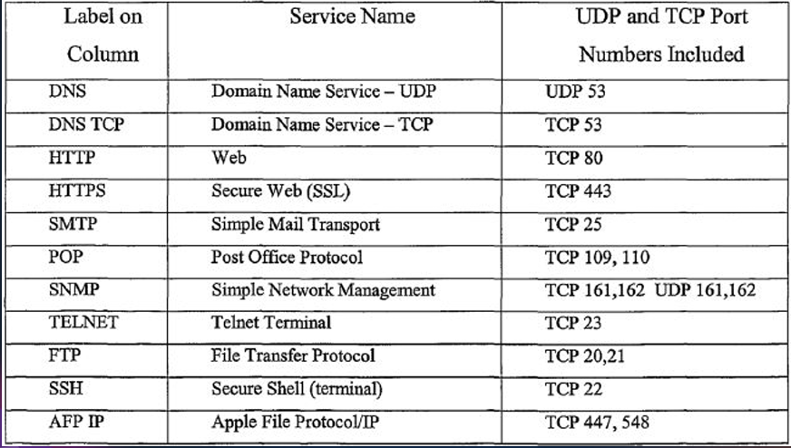

# Networking

## Introduction

- A Computer Networking is a practice of connecting mutiple computing devices (like computers, servers, switches, routers, phones etc) so they can communicate, share data and use shared resources like printers, files or internet access. As its core computer network enables devices to `Send and Recieve Data using wired (Ethernet) or wireless (Wi-Fi) communication.`, `Access remote resources such as files or applications hosted on other machines` and `connect to internet which is the largest public network in the world`.

- We can simply say that a computer network is communication between two or more network interfaces. A network interface is a point of connection between computer and network. Generally it refers both hardware like (network card, Ethernet port or Wi-Fi adapter in our computer) and software configuration (like ip addresses, MAC Addresses, and protocols) that allows comminication over network. So we can say network interfaces is a door way to enter into computer network just like a door to enter into a room, a device needs a network interface to connect and talk to other devices.

- The components involved in a computer network are : Two or more computers or devices, Cables as link between the computers, A Network interfacing Card on each, Swiches, Routers etc.

- Generally there are different configured around the world which are LAN (Local Area Network), WAN (Wide Area Network), Internet (Public Network).

- So whenever you request a url in the browser, first browser resolves its DNS and finds the correct IP and requests the OS to connect to the IP. Then OS asks the network interface in the system which might be Ethernet cable or Wi-Fi Adapter to connect to that IP. Then network interface send request to router (via radio signal if it is Wi-Fi or through cables if it Ethernet) then router sends this request to ISP (Internet Service Provider) via mutiple networking devices. Then ISP sends this request to nearest sever of that IP and that server responds with requested data and data travels the same reverse path that request has been travelled initially.

## OSI Model

- People around the world uses computer network to comminicate with each other. For worldwide data comminication, systems must be developed in such as way that they are compatiable to commnicate with each other. There should be standard communication methods and devices. International Organization and Standardization (ISO) has developed this standard. This communication model is called as Open System Interconnection (OSI)

- The OSI (Open System Interconnection) model is a 7-layer framework that describes how data moves from one device to anothor across the network. Each layer has a specific job and communicates with the layers above and below it.

- The 7 layers in the OSI model are :

  **Application Layer (Layer 7)** : This is the closet layer to end user. Its not about the actual application (like google chrome), but about protocols that allows software to communicate over the network. When you open a website, your browser uses HTTP/HTTPs, which is an Application Layer Protocol. If you are using email, protocols like SMTP, POP3, or IMAP operate here. The application layer provides services such as file transfers, remote login, email, and web browsing. We can this layer is an interface where your software applications interact with the network.

  **Presentation Layer (Layer 6)** : This layer ensures the data sent from one system can be understood by another, despite differences in data formats, charecter encoding, or encryption. It tanslates data formats like JPEG, MP4, PDF, etc. It encrypts/decrypts your web data during HTTPS connections using protocols like SSL/TLS. It also compresses or decompresses data (e.g gzip websites). So if your browser is sending data securely, this layer handles encryption (so only intended recipient can read it) and ensures format is usable. We can this this layer as translater or interpreter between you and anothor party.

  **Session Layer (Layer 5)** : The session layer is responsible for establishment, maintainance, and termination of communication sessions between two devices. It opens a session (like temporary phone call) between your computer and server. It can sychronize data (e.g checkpoints during large transers). When you are watching a youtube video or downloading a file, it makes sure the session remains intact. We can think this layer as the one that keeps track of conversations between devices - who is taking to whom and when conversation ends etc.

  **Transport Layer (Layer 4)** : This layer is responsible for end-to-end communication and reliability. It breaks data into segments and numbers them so they can be reassembled. It ensures reliable delivery, meaning data arrives without errors, in the correct order and only once. The most common protocol is TCP (used for web browsing) and UDP (used for video streaming or gaming where speed > reliability). Ports also live here e.g. port 80 for HTTP, port 443 for HTTPs. We can think this layer as delivery service which tracks each box (segments) and ensures everything arrives correctly and on time.

  **Network Layer (Layer 3)** : The Network Layer decides how data routes from source to destination. It uses IP addresses to identify each device. It adds IP Headers to the data and routes data through various intermediate routers on the way to destination. Common protocols here : IP (Internet Protocol), such as IPv4 and IPv6. Routers operate at this layer. We can think of this layer as GPS and road system which figures out the best path to get your data from your laptop in new york to server in california.

  **Data Link Layer (Layer 2)** : The data link layer takes data from network layer and converts it into frames for transmission on physical network. Each frame contians a MAC address, which is the hardware address for a device's network card (e.g your wifi adapter). It uses ARP (Address Resolution Protocol) to find MAC Address for IPs on local network. It also handles error detection and flow control. Switches operate in this layer. This layer as local mail carrier  which is responsible for delivering mail from your house to nearest post office (your router) using street address (MAC address).

  **Physical Layer (Layer 1)** : This is the lowest layer. It Involves the actual transmission of binary data (0s and 1s) over a physical medium. It could be electrical signals on a wire (Ethernet), radio waves (Wi-Fi), or light pulses (fiber optic). This layer deals with cables, connectors, voltages, frequencies, and transmission rates. Our device Wi-Fi adapter, Ethernet Cables, network interface card (NIC) operates here. We can think this layer as truck or fiber cable that actually carries boxes (data) physically.

- Now lets see the main difference between IP addresses and MAC addresses. We understand the difference with an analogy. Suppose we are living in a community which has multiple flats numbering from 100 to 800. Generally people inside the community comminicate each other by using the flat numbers. They doesn't need the community address. Suppose if a person living outside wants to come to this community to meet a friend then he first need to know the community address to reach the community then he needs to know th flat number of his friend to reach his friend flat. Here we can think community address is IP address and flat numbers are MAC (Media Access Control) address. When ever some one outside of this network wants to access your network, then that device first sends request to the public address of the router which is the gateway to your netwrok (community) then router communicate your device by using MAC address. So we can say devices within a network communicates using MAC address. If devices from different network wants to communicate then we must need to use IP address. For global communication we need IP addresses and for local communication we need MAC address.

- **Example of OSI Model** : When you open the chrome, type `https://google.com` and hit enter then at application layer (7), chrome creates an HTTPS request to google server, then this request encrypted by TLS in presentation layer (6). Now a session is created between your computer and google's server by session layer (5). Now the request is split into TCP segments and each segment is assigned with sequence number by Transport Layer (4). Now network layer (3) adds a header with your IP and google servers IP to each segment. Now data link layer (2) attaches the MAC address of the device to each frame, so the frame can travel to router. Now at physical layer (1), the signal is transmited over Wi-Fi to your router, from there out of the internet.

## Classification of Networks 

- **PAN** : PAN stands for Personal Area Network. It is smallest in range usually owned by a single person. PAN is mostly wireless such as connecting your smartphone with bluetooth devices such as airpods, headset etc. 

- **LAN** : LAN stands for Local Area Network which is common in homes, schools, and offices. It has high speed and low latency. It can be wired through ethernet or wi-fi. All computers in the lab are connected to same router is an example of LAN.

- **CAN** : CAN stands for Campus Area Network which is larger than LAN. It spans accross multiple bulidings in a single institution. It is often uses fiber optics for buliding the network. For example University network connecting labs, library, dorms etc.

- **MAN** : MAN stands for Metropolitan Area Network which spans a city or town. It is usually maintained by ISPs or large organizations. It uses technologies such as Metro Ethernet, leased lines etc. Examples of MAN are city trafic control netwrok or cable TV System.

- **WAN** : WAN stands for Wide Area Network which is largest in scale. It connects Multiple LANs and MANs. It is usually owned by multiple organizations or ISPs. For example internet comes under WAN.

## Networking Devices 

- There are actually 4 main devices that are involved to build a network. Those are Hub, Switch, Router and Modem.

  **HUB** : HUB is a networking device which is used to connect mutiple devices/computers using cables in a Local Area Network. It actually copies incoming bits to all other ports. Suppose in a LAN, 4 computers are connected using a HUB via cables, if comp1 sends a request to comp2, then the request sent by comp1 goes to all other devices/computers connected over the hub instead of going only to comp2. This causes netwrok congestion and collision. So Hub just copies all the incoming data/bits to all other remaining ports. The main purpose of HUB is to connect mutiple devices/computers for buliding a network.

  **Switch** : A Switch is a networking device which has a similar functionality of HUB. It also connect mutiple devices to bulid a network but it is much smarter than HUB. Becuase it understands the Ethernet frames, learns MAC addresses and bulids a MAC address table (which has port number and MAC address of the device conneted on this port). When Comp1 sends a request to comp2 the switch first checks the destination MAC address on the frame and forwars the frame only to the port where Comp2 is connected.

  **Modem** : A Modem is a networking device which converts the analog  signals to digital signals and viceversa. Generally computer understands only bits (0's and 1's). But the signals passed through fibers and radio waves (for wireless network) are analog signals. So we need a modulator which actually converts the analog signal to digital signal. We can actually connect single device with modem to connect over internet. In order to connect mutiple devices we need the Router.

  **Router** :  Router is used to bulid a network which connects the devices in LAN to Outside networks ot internet. It is a gateway to exchange data between mutiple networks. Modem works similar to router but does an addition work of mdulating the signal from analog to digital or digital to analog. But we know a single device is connected to modem and we connect that ingle device through ethernet cable only. Modem doesn't offer any wireless access points. Whereas router has mutiple ports through which 2 to 4 devices can be connected via ethernet cables or it also has wireless access points to connect mutiple devices through Wi-Fi. Generally router has in-built switch through which we connect to mutiple devices. But at max we can connect only 2 to 4 devices by using router in-bulit switch. If you wanna connect more than 4 devices then we need to by external switch to connect mutiple devices and this switch is connected to router and this router is connected to modem. 

- But now a days , ISPs are providing a single device which comes with router, modem and an internal switch which can cable of connecting 2 to 4 devices. But modren routers has wireless access points (Wi-Fi adapter), so we doesn't external switch.

- So, we can say that, our computers/devices are connected to switch and that switch is connected to router and router is connected to modem. So when ever we request an IP, first our network interface searches wheather that IP is in our subnet or not (is in our LAN or not). If it is in the LAN then it checks the corresponding MAC address of that IP in the ARP table. If our system doesn't have corresponding MAC address of that IP then it sends a ARP request to that device and device responds back with that MAC address and our network adapter sends this frame to switch. Then switch checks the port of the destination MAC address and sends the request via that port. This is how data packets transfer from one device to anothor device if devices are in same network.

- If IP is not in the local subnet then our network interface request ARP for default Gateway (Which is router). The router responds back with its IP, then data packet transfered to switch then switch finds the port to which router is connected by using routers MAC address and sends that data packet to router. Now router also checks whether this Ip is in Local Subnet or not. If not then it send it next hop by finding the MAC address of next Hop by using ARP. This is how data packets transfer over networks.

## IP Address

- IP address stnads for Internet Protocol. IP addresses are used to route the devices/computers over internet. We have two types of IP addresses. One is IPv4 and 2nd one is IPv6. But mostly people will use IPv4 addresses.

- IPv4 address contains 32 bits. The structure of IPv4 has 4 octants and each octant carries 8 bits. For example `192.168.12.10` is an IPv4 addresses and you can that number is divided into 4 octants by a decimal point. First octant is `192`, 2nd octant is `168`, 3rd octant is `12` and 4th octant is `10`. Since each octant has 8 bits, so the maximum value of each octant is 255. So IPv4 ranges from `0.0.0.0.0` to `255.255.255.255`.

- There are two types in IPv4. Those are Public and Private IPs. Public IPs are mainly used to route in internet. Because internet does recognize the private IPs. Whereas Private IPs are mainly used in local network design. So in order to enter into this local network we actually need to use a router which has NAT (Network Address Transulator) and that converts the private Ips into public Ips.

- There are actually 3 types in Private IP Ranges. First one is `Class A`. Class A addresses are ranges from `10.0.0.0` to `10.255.255.255`. Second one is `Class B`. Class B addresses ranges from `172.16.0.0` to `172.31.255.255`. Third one is `Class C`. `Class C` addresses ranges from `192.168.0.0` to `192.168.255.255`.

- IP addresses are hirerarchical. Because of this they are used it for routing. Suppose consider this IP `192.168.10.5`. Here the first part (`192.168.10`) represents the network and last part (`.5`) represents the host (i mean device in the network). So if you see the first part of IP address then we can which network it is after then we can decide to whom we need to reach in that network. Whereas MAC addresses are not hierarical. They are designed for uniqueness of the device. The MAC address actually looks like `00:1A:2B:3C:4D:5E`. The first 3 bytes (`00:1A:2B`) is to identify the manufacturer (organizationally unique identifier). The last 3 bytes are assigned by manufacturer. If you consider the an example of mailing a letter, the postal address (IP address) has country, city, zip code which we can consider IP and that helps us to route across the globe and the persons name (MAC address) just tells us the final delivery person to whom we need to hand it once we reached the delivery person.

## Protocols 

- A Protocol is basically a set of rules that devices follow to communicate with each other over a network. We can think it as a language through which two computers can talk each other.

- There are actually different types of Protocols. But mainly we have two types. Those are **Application Layer Protocols** and **Transport Layer Protocols**.

- **Application Layer Protocols** are used for different services such as `HTTP` (HyperText Transfer Protocol), `HTTPS` (HyperText Tansfer Protocol with encryption) are used for web browsing, `FTP` (File Transfer Protocol) is used for file tansfers, `SMTP` (Simple Mail Transfer Protocol) is used for sending mails, `DNS` (Domain Name System) is used to convert the names like google.com into IP addresses.

- **Transport Layer Protocols** are used for establishing the connection between the source and destination and transfers the data packets over the network. There are mainly two transport layer protocols. Those are `TCP` (Transmission Control Protocol) and `UDP` (User Datagram Protocol).

  **TCP** : TCP is a polite and careful delivery service which means it won't stop until your message gets delivered correctly and in right order. TCP is connection oriented which means a handshake happens before data tranfer (like "Hello can we talk ?"). It is relaible also which means if data is lost in the middle, it resent it. TCP make sure the data arrives in the sam order it was sent. TCP is know for its error checking. It detects all the errors and fix them while retransmitting. It is slower than UDP. TCP is mainly used for Web Browsing (HTTP, HTTPS), Email (SMTP, IMAP, POP3), File Transfers (FTP), Remote Login (SSH). 

  **UDP** : UDP is fast and casual delivery service which means it just sends the packets without checking whether they are arrived or not. UDP is connectionless which means No handshake, just fires off the packets. It is unreliable which means no gaurantee whether packets will arrive or not. IN UDP ordering doesn't matter, packets might arrive in different order. It is faster because it skips reliability checks. UDP is mainly used for Streaming video and audio, Online Gaming, Voice Calls, DNS Lookups.

  **Note** : TCP generally uses a three way handshake which means client first asks server that `I want to talk with you` (Synchronize - SYN) then server responds back with a message `Sure, I will hear you. Lets Talk` (Synchronize and Acknowledgement - SYN & ACK) and then client responds `Lets talk` (Acknowledement - ACK). In these process, we might get 2 errors. Those are `This site cannot be reached`, `connection refused`. When TCP tries to talk to the server at start in three way handshake, but server doesn't reply , but TCP tries many times but server won't reply back. Then we can see that `Site cannot be reached` error which means there is not server at that IP. Second one is when TCP tries to talk to server but server responds with TCP RST which is reset, then we can see an error `Connection Refused`. In this scenario, Server is there at that IP but the service we are requesting may not be running on that port or port is not open.

- Usually people gets confused about session layer and transport layer that session layer is responsible for establishment of connection but here TCP is establishing the connection. Pactically connection is established in transport layer and session layer is responsible for mainintaing the converstion between them from start of the connection to its end.

## Ports

- A port is virtual point where network connections start and end. It is actually like a door number on a computer that lets the right service or application gets the data. 

- For example your computer has an IP address. But it can run many services at once such as web server, an email server, a file server etc. Each service listens on specific port number. Generally we can say protocol defines how to talk, but port defines where to send the data.

- In a computer we have 3 different types of ports. Those are :

  **Well Known Ports**  : Well Known Ports ranges from 0 to 1023 which are generally used for some standard services like HTTP (80), HTTPS (443), SSH (22). Many will be empty if you aren't running any services.

  **Registered Ports** : Registerd Ports ranges from 1024 to 49151 which are generally used for applications such as MySQL (3306), RDP (3389). Whenever you are installed the applications, these applications runs on registered ports itself.

  **Dynamic/Ephemeral Ports** : It ranges from 49152 to 65535. It is used temporarily by OS when you connect with other systems

- Generally, when a port is open only if some program/service is actively listening on it. A port is “closed” or empty if no application is using it.

- Standard Ports that we need to remember are :

  

  